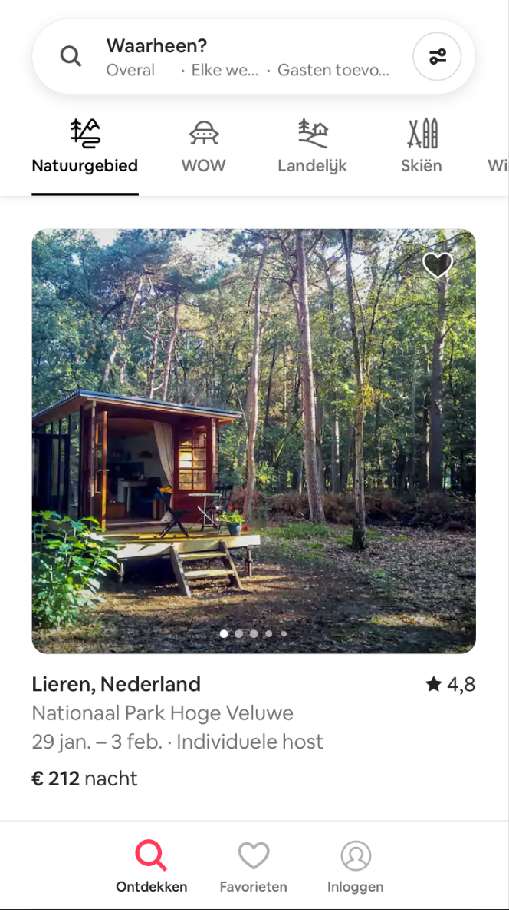
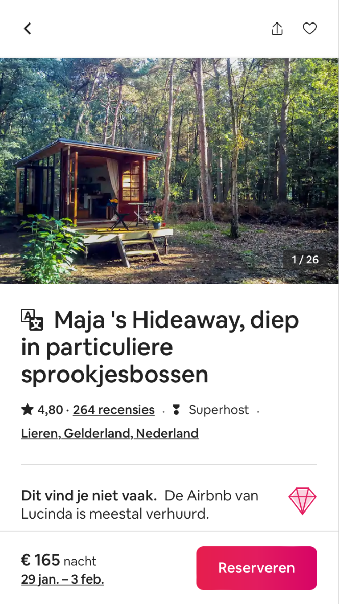
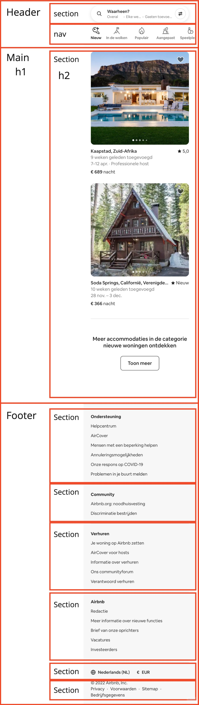
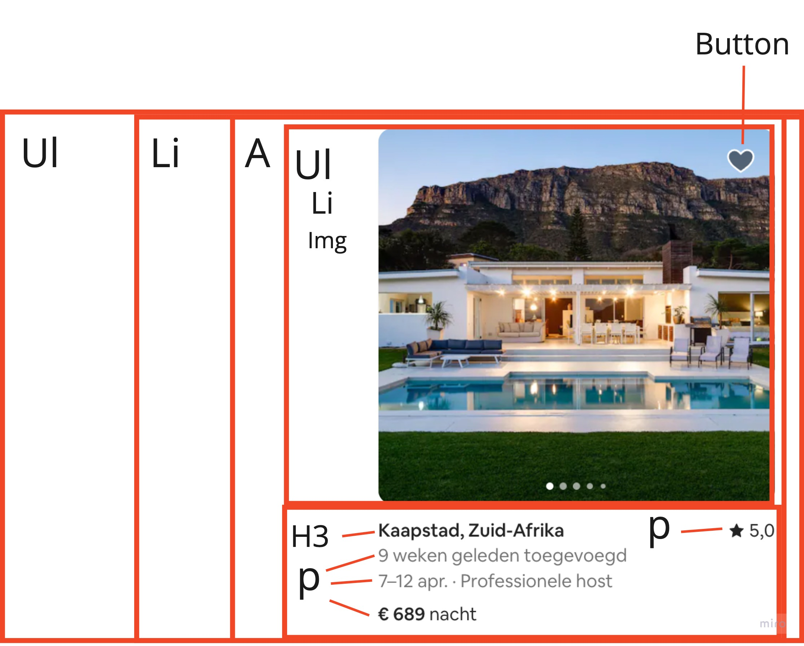

# Procesverslag
Markdown is een simpele manier om HTML te schrijven.  
Markdown cheat cheet: [Hulp bij het schrijven van Markdown](https://github.com/adam-p/markdown-here/wiki/Markdown-Cheatsheet).

Nb. De standaardstructuur en de spartaanse opmaak van de README.md zijn helemaal prima. Het gaat om de inhoud van je procesverslag. Besteedt de tijd voor pracht en praal aan je website.

Nb. Door *open* toe te voegen aan een *details* element kun je deze standaard open zetten. Fijn om dat steeds voor de relevante stuk(ken) te doen.

## Jij

  
uitwerken voor kick-off werkgroep

  ### Auteur:
  Jordy van Wetering

  #### Je startniveau:
  Rood

  #### Je focus:
  Surface Plane
 

## Je website

  
uitwerken voor kick-off werkgroep

  ### Je opdracht:
  [Airbnb](https://www.airbnb.nl)
  
  #### Airbnb home pagina: 
  
  
  #### Airbnb pagina van een bungalow: 
  
 

## Toegankelijkheidstest 1/2 (week 1)

  
uitwerken na test in 1e werkgroep

  ### Bevindingen
  Lijst met je bevindingen die in de test naar voren kwamen:
  -met een screenreader kan je niet de headings selecteren
  -direct naar inhoud knop is aanwezig
  -er wordt weinig kleur gebruikt waardoor het accessible is voor mensen met kleurenblindheid
  -geen mogelijkheid om airbnb host te worden met gebruik van een screenreader

  #### Screenreader
  Tijdens het gebruiken van een screenreader kan je niet via de headings door de hele website heen, je kan alleen door de footer heen navigeren.
  Dit zou opgelost kunnen worden door alle headings in H1-6 elementen te zetten.

  #### Muis en Toetsenbord 
  Je kan goed door de website heen navigeren door gebruik te maken van het toetsenbord. Ook kan er door de kaart heen genavigeerd worden met het toetsenbord.
  Het zou heel lang duren voordat iemand bij de onderste navigatie komt wat opgelost zou kunnen worden door de navigatie door het aanbod als laatste te selecteren.

  #### Motoriek (shocks, elastiekjes)
  De grootte van knopjes op de website helpt met het lastig bedienen van de website. Het maakt het lastig om door de afbeeldingen van de huizen te gaan maar dit is opgelost door gebruik van 

  #### Visueel (brillen, contrast, kleurenblind, dark/light). 
  Doordat er weinig kleur gebruikt wordt op de website kunnen mensen met kleurenblindheid ook normaal gebruik maken van de website.
  Er is geen dark mode wat sommige gebruikers kan helpen, dit is dus op te lossen door een dark mode functionaliteit toe te voegen.

## Breakdownschets (week 1)

  
uitwerken na afloop 2e werkgroep

  ### de hele pagina: 
  

  ### dynamisch deel (bijv menu): 
  

## Voortgang 1 (week 2)

  
uitwerken voor 1e voortgang

  ### Stand van zaken
  De header maken ging best goed, ik had erg veel moeite met de carroussel werkend maken op mijn site. 

  ### Agenda voor meeting
  samen met je groepje opstellen

  | Jordy          | Nikki              | Lars S       | student 4        |
  | ---            | ---                | ---          | ---              |
  | hoe kan ik mijn carroussel laten werken | en dit             | en ik dit    | en dan ik dat    |
  |     | dit als er tijd is | nog een punt | dit wil ik zeker |
  |    | ...                | ...          | ...              |

  ### Verslag van meeting
  Ik heb de carroussel laten kunnen werken en moet nog een manier vinden om deze te combineren met de informatie die er bij hoort.
  Over het algemeen gaat het al goed met mijn website.

  - goed onderweg
  - css netter maken
  - css targeting probleem waardoor carroussel niet werkt
  - grid positioning voor de footer

## Voortgang 2 (week 3)

  
uitwerken voor 2e voortgang

  ### Stand van zaken
  Carroussel is uitendelijk goed gelukt, ik stel de widget erg uit omdat ik niet weet hoe erg ik deze ga uitwerken.

  ### Agenda voor meeting
  samen met je groepje opstellen

  | Jordy                 | student 2          | student 3    | student 4        |
  | ---                   | ---                | ---          | ---              |
  | Inline posititioning met svg icoon.  | en dit             | en ik dit    | en dan ik dat    |
  |        | dit als er tijd is | nog een punt | dit wil ik zeker |
  | Margin bij de carroussel         | ...                | ...          | ...              |
  |             |

  ### Verslag van meeting

  - margin voor carroussel moest op de section en niet de img's
  - svg bevat heel vele troep waardoor mijn css niet werkte

## Toegankelijkheidstest 2/2 (week 4)

  
uitwerken na test in 8e werkgroep

  ### Bevindingen
  Screenreader gebruik gaat beter, headers en links worden voorgelezen en zijn klikbaar. De site is te bedienen met muis en toetsenbord en er zijn focus states aanwezig. De site gebruikt een klein kleurenpalet waardoor het voor mensen met een visuele beperking alsnog mogelijk is de site te gebruiken.

  #### Screenreader
  Je kan door middel van een screenreader door de website heen lopen en een boeking reserveren.

  #### Muis en Toetsenbord 
  Er wordt goed gebruik gemaakt van verschillende button states waardoor het mogelijk is om te zien wat interactief is en wat niet. Ook zie je waar je bent op de website door deze states.

  #### Motoriek (shocks, elastiekjes)
  Het is lastig om de foto's van een Airbnb te bekijken als de motoriek van een persoon minder is, dit heb ik verbeterd door ervoor te zorgen dat de carroussel bediend kan worden door middel van het toetsenbord.

  #### Visueel (brillen, contrast, kleurenblind, dark/light). 
  Doordat er een simpel kleurenpalet gebruikt wordt is het alsnog mogelijk om gebruik te maken van de website als iemand visueel beperkt is. Er is geen dark mode aanwezig, deze heb ik zelf wel toegevoegd.

## Voortgang 3 (week 4)

  
uitwerken voor 3e voortgang

  ### Stand van zaken
  Het was lastig om te beginnen met het positioneren van de tweede pagina, maar dit is toch wel gelukt. Mijn css heb ik wat netter gemaakt door middel van meer ruimte tussen code en comment blocks.

  ### Agenda voor meeting
  samen met je groepje opstellen

  | Jordy      | student 2          | student 3    | student 4        |
  | ---            | ---                | ---          | ---              |
  | Buttons over het plaatje  | en dit             | en ik dit    | en dan ik dat    |
  |  | dit als er tijd is | nog een punt | dit wil ik zeker |
  |             | ...                | ...          | ...              |

  ### Verslag van meeting

  - css targeting moet verbeterd worden.
  - moet tweede pagina positioneren

## Eindgesprek (week 5)

  
uitwerken voor eindgesprek

  ### Je uitkomst - karakteristiek screenshots:
  

  ### Dit ging goed/Heb ik geleerd: 
  Korte omschrijving met plaatjes

  

  ### Dit was lastig/Is niet gelukt:
  Korte omschrijving met plaatjes

  

## Bronnenlijst

  
continu bijhouden terwijl je werkt

  Nb. Wees specifiek ('css-tricks' als bron is bijv. niet specifiek genoeg).

  1. bron 1
  2. bron 2
  3. ...

